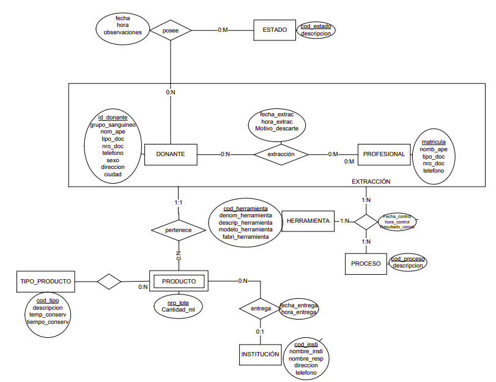

# Quizz SQL 2020

**Nivel de dificulad**: Parcial

**Autor**: Adrián Meca

**Comisión**: 305

**Link**: https://github.com/adrianmeca/sqlquizz/blob/master/2020-resolucionQuizzSql.md

## Alcance

[TOC]

## Modelo: Banco de Sangre



## Pasaje a Tabla

El pasaje a tabla pueden encontrarlo en este [link](./pasajeTabla/2020-PTBancoSangre.md)

## SELECT & JOIN

**Temas**: SELECT - WHERE - ORDER BY - INNER JOIN - LEFT JOIN

1. Listar los productos entregados a cada institución en los últimos 6 meses. Indicando, código y nombre de la institución, código y descripción del tipo de producto, nro de lote y cantidad en ml de producto. Ordenar por nombre de institución, descripción de tipo de producto y fecha y hora de entrega ascendente

   #### Resolución

   | dificultad                                 | importancia |
   | :----------------------------------------- | ----------: |
   | múltiples join con su respectivo on        |         0.5 |
   | condición de where (no importa el adddate) |        0.25 |
   | order by                                   |        0.25 |
   
   ```mysql
   select inst.cod_insti, inst.nombre_insti
     , tp.cod_tipo, tp.descripcion
     , prod.nro_lote, prod.cantidad_ml
   from producto prod
   inner join institucion inst
     on inst.cod_insti=prod.cod_insti
   inner join tipo_producto tp
     on prod.cod_tipo=tp.cod_tipo
   where prod.fecha_entrega > addate(now(), interval -6 month)
   order by inst.nombre_insti, tp.descripcion, prod.fecha_entrega, prod.hora_entrega;
   ```
   
   
   
2. Listar las extracciones realizadas por un profesional (use un nombre y apellido cualquiera de su base de datos) y los controles realizados, indicando, matricula, nombre y apellido, fecha y hora de extracción y de cada control indicar fecha y hora de control y resultado. Ordenar por fecha y hora de control descendentes. Elija un nombre de profesional cualquiera que tenga extracciones y controles.

   #### Resolución

   | dificultad                                   | importancia |
   | :------------------------------------------- | ----------: |
   | múltiple joins con su on                     |         0.2 |
   | join con multiples campos **(FK compuesta)** |         0.6 |
   | condición de where                           |         0.1 |
   | order by                                     |         0.1 |

   ```mysql
   select prof.matricula, prof.nomb_ape
     ,ext.fecha_extraccion, ext.hora_extraccion
     ,cont.fecha_control, cont.hora_control, cont.resultado
   from profesional prof
   inner join extraccion ext
     on prof.matricula=ext.matricula
   inner join control cont
     on ext.id_donante=cont.id_donante
     and ext.fecha_extraccion=cont.fecha_extraccion
     and ext.hora_extraccion=cont.hora_extraccion
   where prof.nomb_ape='Edward Elric'
   order by cont.fecha_control desc, cont.hora_control desc;
   ```

3. Listar para cada extracción de este año el donante, profesional, los productos obtenidos y a qué institución fueron entregados. Si de una donación no se obtuvieron productos deben mostrase igualmente. Indicar id_donante, grupo sanguineo, nombre y apellido del profesional, fecha de extracción, motivo de descarte (si no tiene debe indicarse "Sin descarte"), código y descripción del tipo de producto, nro de lote y cantidad de ml. Ordenar por cantidad descripción del tipo de producto ascendente y cantidad de ml descendente.

   #### Resolución

   | dificultad                | importancia |
   | :------------------------ | ----------: |
   | left join encadenados     |        0.45 |
   | múltiples joins con su on |        0.15 |
   | join con FK compuesta     |        0.25 |
   | condición de where        |        0.05 |
   | order by                  |        0.05 |
   | coalesce                  |        0.05 |

   ```mysql
   select don.id_donante, don.grupo_sanguineo, prof.nomb_ape
     , ext.fecha_extraccion, coalesce(ext.motivo_descarte, 'Sin descarte') motivo_descarte
     , tp.cod_tipo, tp.descripcion
     , prod.nro_lote, prod.cantidad_ml
     , ins.cod_insti, ins.nombre_insti
   from extraccion ext
   inner join donante don
     on ext.id_donante=don.id_donante
   inner join profesional prof
     on ext.matricula=prof.matricula
   left join producto prod
     on ext.id_donante=prod.id_donante
     and ext.fecha_extraccion=prod.fecha_extraccion
     and ext.hora_extraccion=prod.hora_extraccion
   left join tipo_prod tp
     on prod.cod_tipo=tp.cod_tipo
   left join institucion ins
     on prod.cod_insti=ins.cod_insti
   where ext.fecha_extraccion between '20200101' and '20201231'
   order by tp.descripcion, prod.cantidad_ml desc;
   ```

4. Listar los profesionales y para cada uno las extracciones realizadas este año. Si no realizó ninguna este año deberá mostrarse igualmente.
   Indicar, matricula, nombre y apellido, fecha y hora de extracción y grupo sanguineo. Ordenar por nombre y apellido del profesional alfabeticamente.

   #### Resolución

   | dificultad                                               | importancia |
   | :------------------------------------------------------- | ----------: |
   | left join con condicion de **subconjunto (no en where)** |         0.6 |
   | left join encadenados                                    |        0.35 |
   | order by                                                 |        0.05 |

   ```mysql
   select prof.matricula, prof.nomb_ape
     , ext.fecha_extraccion, ext.hora_extraccion
     , don.grupo_sanguineo
   from profesionales prof
   left join extracciones ext
     on prof.matricula=ext.matricula
     and ext.fecha_extraccion >= '20200101'
   left join donante don
     on ext.id_donante=don.id_donante
   order by prof.nomb_ape;
   ```

## GROUP BY

**Temas**: GROUP BY - HAVING - TEMAS ANTERIORES

1. Indicar para cada tipo de producto la cantidad total de ml de producto obtenido y la cantiadad de instituciones diferentes a la que ha sido entregado, si no se ha obtenido producto de ese tipo y/o no ha sido entregado se debe indicar 0. Indicar código y descripción del tipo de producto, cantidad de ml totales y cantidad de instituciones. Ordenar por total de ml descendente y cantidad de instituciones ascendente.

   #### Resolucion

   | dificultad                                         | importancia |
   | :------------------------------------------------- | ----------: |
   | group by                                           |        0.30 |
   | sum (y no count de producto)                       |        0.25 |
   | count distinct                                     |        0.25 |
   | 0 si no hay  - left join + coalesce + sin count(*) |        0.15 |
   | order by                                           |        0.05 |

   ```mysql
   select tp.cod_tipo, tp.descripcion,
     coalesce(sum(prod.cantidad_ml),0) total_ml,
     count(distinct p.cod_insti) inst_distintas
   from tipo_producto tp
   left join producto prod
     on tp.cod_tipo=prod.cod_tipo
   group by tp.cod_tipo, tp.descripcion
   order by total_ml desc, inst_distintas asc;
   ```

   

2. Indicar los profesional con menos de 2 extracciones descartadas este año. Listar la matricula, nombre, apellido, la cantidad de extracciones y la cantidad de extracciones descartadas (tienen motivo de descarte). Ordenar por cantidad de extracciones descartadas descendente. Si no tienen extracciones descartadas listarlos con cantidad 0.

   #### Resolucion

| dificultad                       | importancia |
| :------------------------------- | ----------: |
| group by                         |        0.30 |
| having y where según corresponde |        0.40 |
| left + count(artib) x2           |        0.20 |
| order by                         |        0.10 |

```mysql
select pro.matricula, pro.nomb_ape
  count(ext.matricula) cant_extrac, count(ext.motivo_descarte) cant_descarte
from profesionales pro
left join extraccion ext
  on pro.matricula=ext.matricula
where ext.fecha_extrac between '20200101' and '20201231'
group by pro.matricula, pro.nomb_ape
having cant_descarte < 2
order by cant_descarte desc
```