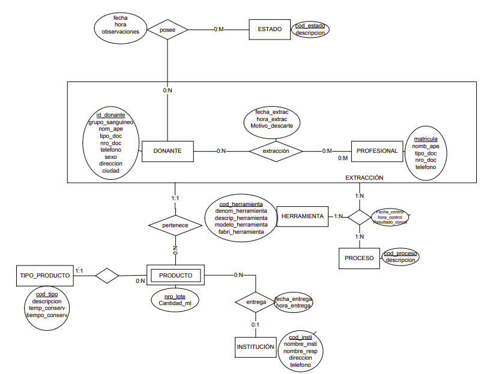

# Enunciado: Banco de Sangre

## Enunciado

El enunciado pueden encontrarlo en este link: [enunciado](./2020-EnunciadoBancoSangre.pdf)

## DER

## Pasaje a Tabla

**ESTADO**(<ins>cod_estado</ins>, descripcion)

CP(**cod_estado**)

 
 

**PROCESO**(<ins>cod_proceso</ins> descripcion)

CP(**cod_proceso**)

 
 

**HERRAMIENTA**(<ins>cod_herramienta</ins>, denom_herramienta, descrip_herramienta, modelo_herramienta, fabri_herramienta)

CP(**cod_herramienta**)

 
 

**TIPO_PRODUCTO**(<ins>cod_tipo</ins>, descripcion, temp_conserv, tiempo_conserv)

CP(**cod_tipo**)

 
 

**INSTITUCION**(<ins>cod_insti</ins>, nombre_insti, nombre_resp, direccion, telefono)

CP(**cod_insti**)

 
 

**DONANTE**(<ins>id_donante</ins>, grupo_sanguineo, nom_ape, tipo_doc, nro_doc, telefono, sexo, direccion, ciudad)

CP(**id_donante**)

 
 

**PROFESIONAL**(<ins>matricula</ins>, nomb_ape, tipo_doc, nro_doc, telefono)

CP(**matricula**)

 
 

**ESTADO**(<ins>*id_donante*, fecha, hora</ins>, *cod_estado*, observaciones)

CP(**id_donante, fecha, hora**)

*id_donante* --> **CF(DONANTE)** NN

*cod_estado* --> **CF(ESTADO)** NN

 
 

**EXTRACCION**(<ins>*id_donante*, fecha_extrac </ins>, *matricula*, hora_extrac, motivo_descarte)

CP(**id_donante, fecha_extrac**) Ver [CPs](#CPs)

*id_donante* --> **CF(DONANTE)** NN

*matricula* --> **CF(PROFESIONAL)** NN

 
 

**PRODUCTO**(<ins>*cod_tipo*, nro_lote</ins>, cantidad_ml, fecha_entrega, hora_entrega, *cod_insti*)

CP(**cod_tipo, nro_lote**)

*cod_tipo* --> **CF(TIPO_PRODUCTO)** NN

*cod_insti* --> **CF(INSTITUCION)** NULL

 
 

**CONTROL**(<ins>*id_donante, fecha_extrac*, *cod_proceso*, *cod_herramienta*, fecha_control, hora_control</ins>, resultado_control)

CP(**id_donante, fecha_extrac, cod_proceso, cod_herramienta**) Ver [CPs](#CPs)

*id_donante, fecha_extrac* --> **CF(EXTRACCION)** NN

*cod_proceso* --> **CF(PROCESO)** NN

*cod_herramienta* --> **CF(HERRAMIENTA)**

 
 

## Notas

### CPs

* Para la CP de extracción también se acepta incluir la hora de extracción en especial para quienes usaron atributo datetime.
* Para la CP de control se utiliza la misma CF de extracción que debe ser igual a la CP
